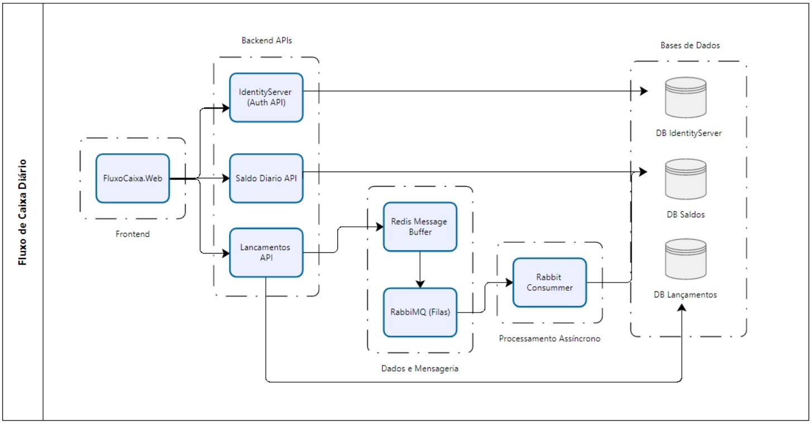

# Projeto Fluxo de Caixa Diário 🚀

Este projeto é uma **aplicação de exemplo para um sistema de Fluxo de Caixa Diário**, arquitetada com base em **microserviços**, desenvolvida seguindo as **melhores práticas**, **padrões de projeto** e com foco em **escalabilidade**, **resiliência**.

---

## 🗺️ Fluxograma da Arquitetura



---

## 🏢 Visão Geral da Arquitetura

O sistema foi construído com um conjunto de **microserviços independentes** que se comunicam de forma **assíncrona** para garantir **alta disponibilidade**, **tolerância a falhas** e garantir um maior **desacoplamento** entre as classes.

### Decisões Chave

* **Microserviços:** Separação das responsabilidades em serviços distintos (Lançamentos, Saldo Diário, Identity).
* **Domain-Driven Design (DDD):** Desenvolvimento alinhado com as necessidades com base no domínio do negócio.
* **Comunicação Assíncrona + Event-Driven Design (EDD):** Utilização de um **Message Broker (RabbitMQ)** para o **desacoplamento** e **resiliência** entre o serviço de Lançamentos e o de Consolidação Diária.
* **Buffer de Mensagens com Redis:** O serviço de Lançamentos utiliza o **Redis** como um **buffer temporário e seguro** para agrupar transações e enviá-las em lote para o RabbitMQ. Isso otimiza o rendimento  e reduz a carga no broker em picos de requisições de lançamentos.
* **Contêinerização:** Utilização de **Docker** e **Docker Compose** para **isolamento**, **portabilidade** e **orquestração** dos serviços.

---

## 🎨 Padrões de Projeto e Melhores Práticas de Desenvolvimento

A aplicação utiliza princípios alguns **padrões de design** para promover **manutenibilidade**, **testabilidade** e também a **escalabilidade**.

### Padrões de Projeto (Design Patterns)

* **Repository Pattern:** Abstrai a camada de acesso a dados, facilitando a troca de implementações de persistência e isolando a lógica de negócio dos detalhes do banco de dados.
* **Mediator Pattern (MediatR) com CQRS (Command Query Responsibility Segregation):** Este design aprimora a **separação de responsabilidades** e a **organização do código** nos microserviços, tornando a aplicação mais escalável, testável e fácil de manter e com menor acoplamento possível.
    * **CQRS:** Divide as operações de persistência de dados (**Comandos**) das operações de leitura (**Queries**). Isso permite otimizar e **escalar operações de leitura e escrita independentemente**.
    * **Mediator (MediatR):** Atua como um "dispatcher" para comandos e queries. Remove a dependência direta entre o emissor (Controller/Service) e o receptor (o Handler), promovendo um **acoplamento fraco** e um fluxo de trabalho claro para o processamento de requisições.
    * **Benefícios da Aplicação de CQRS e Mediator:**
        * **Controllers mais leves:** Apenas orquestram a entrada e saída, sem conter lógica de negócio.
        * **Intenções Claras:** Comandos e Queries representam ações e consultas explícitas da aplicação.
        * **Handlers Pequenos e Isolados:** Foco em uma única responsabilidade (SRP), tornando-os fáceis de testar em unidade e oferecer alterações (OCP).
        * **Escalabilidade (CQRS):** Permite que as operações de leitura e escrita sejam otimizadas e escaladas independentemente.
        * **Organização de Código:** Estrutura de pastas baseada em Comandos e Queries torna o código mais fácil de manter e navegar.
        * **Extensibilidade (OCP):** Adicionar novas funcionalidades (novos comandos ou queries) não requer modificação de código existente nos Controllers ou no IMediator.
* **Injeção de Dependência:** Gerencia as dependências das classes e componentes, promovendo a **inversão de controle**, facilitando a **testabilidade** e o **reuso de código**.

Foi procurado utilizar o padrão de boas práticas de desenvolvimento de software abaixo.
### Princípios SOLID

* **Single Responsibility Principle (SRP):** Cada classe possui uma única responsabilidade única e bem definida.
* **Open/Closed Principle (OCP):** Aberto para extensão, mas fechado para modificação.
* **Liskov Substitution Principle (LSP):** Classes derivadas devem ser substituíveis pelas suas classes base.
* **Interface Segregation Principle (ISP):** Interfaces pequenas e coesas.
* **Dependency Inversion Principle (DIP):** Módulos de alto nível não devem depender de módulos de baixo nível. Ambos devem depender de abstrações. Abstrações não devem depender de detalhes. Detalhes devem depender de abstrações.

---

## 🔒 Segurança e Autenticação (IdentityServer)

O projeto utiliza **IdentityServer** com protocolo **OpenID Connect (OIDC)**, implementado com a biblioteca **Duende IdentityServer**.

 Embora não utilizado neste protótipo de sistema, o IdentityServer está preparado para controlar **escopos por tipos de permissões**, de acordo com o papel do usuário(roles), e delimitar acessos a operações de leitura, escrita e exclusão.

*Informação importante: O Identity Server não armazena o token no cliente, ele devolve um cookie autenticado em que as APIS internamente via código realizam a decodificação do mesmo para chamadas autenticadas posteriores. Para conseguir o token você deve interceptar via debugger na aplicação o trecho abaixo, ou até mesmo posteriormente obter nas comunicações posteriores das APIS via Header Authorization.*

*var token = await HttpContext.GetTokenAsync("access_token")* 

Obs: Usuários iniciais para testes no arquivo DbInitializer.cs

---

## 📈 Resiliência e Desempenho

O sistema foi pensado para ser **resiliente a falhas** e lidar com **picos de tráfego**, garantindo a **integridade** e **disponibilidade** dos dados.

### Requisitos Não Funcionais Abordados

* **Serviço de Lançamento Não Indisponível se o Serviço de Consolidado Cair:**
    * **Padrão de Mensageria:** O Serviço de Lançamentos publica eventos de transações no RabbitMQ e não espera por uma resposta do serviço de Consolidação de Saldo Diário. Se este estiver offline, as mensagens se acumulam nas filas e são processadas quando ele voltar, garantindo o **desacoplamento**.
    * **Tratamento de ACK/NACK:** Confirmação da mensagem (`BasicAck`) após processamento bem-sucedido ou rejeição (`BasicNack`) em caso de falha, com a opção de re-enfileirar a mensagem.
    * **Circuit Breaker:** Embora a comunicação inicial seja assíncrona, se houvesse alguma dependência síncrona, um padrão *Circuit Breaker* (Polly) impediria que o Serviço de Lançamentos tentasse repetidamente uma conexão falha, evitando lentidão ou travamento.

* **Picos de 50 Requisições/Segundo com Máximo de 5% de Perda de Requisições:**
    * **Assincronicidade:** O consumo de eventos pelo Serviço de Consolidado é assíncrono, permitindo que ele processe em seu próprio ritmo.
    * **Buffer com Redis e Filas de Mensagens:** O Message Broker em conjunto com o Redis(Batch Processor) atuam como um **buffer** para picos de tráfego. Foi implementado um buffer no Redis antes de publicar as mensagens na fila para o RabbitMQ, com parâmetros configuráveis no appsettings, com *BatchSize* de inicalmente 100 mensagens e *BatchIntervalSeconds* de 5 segundos.  
    * **Escalabilidade Horizontal:** Em termos de infra(cloud), não só serviço de Consolidação Diária mas também o de Transações, podem ser **escalados horizontalmente** (múltiplas instância) para distribuir a carga.
    * **QoS (Qualidade de Serviço) do Message Broker:** O RabbitMQ, por exemplo, permite configurar o `prefetch count` para evitar sobrecarga de consumidores.
    * **Retries e Dead-Letter Queues (DLQ):** Em caso de falha no processamento de uma mensagem, o Message Broker foi implementado para tentar novamente (`retries`) ou até as vezes mover a mensagem para uma Dead-Letter Queue (DLQ) para análise manual, **minimizando a perda de dados** e garantindo a resiliência. A perda de 5% de requisições foi minimizada por essas estratégias de reprocessamento.
    * **Controle de Retries com Polly:** Utilizado também para lidar com falhas de transações na persistência de dados de transações e atualização de saldos no banco de dados.

* **Disponibilidade e Tolerância a Falhas:**
    * Se a **API de Lançamentos** cair, mensagens já publicadas estarão no Redis(buffer), e posteriormente no RabbitMQ.
    * Se o **Consummer do (Saldo Diário)** cair, as mensagens se acumulam na fila do RabbitMQ e serão processadas quando ele voltar, sem perda de dados.
    * Falhas no processamento de mensagens são tratadas com *retries*. Isso ajuda a atingir o requisito de no máximo 5% de perda de requisições em picos, já que a maioria das falhas transitórias será resolvida por retries. Para falhas persistentes, a DLQ seria o próximo passo.

Com essa implementação, podemos ter uma comunicação entre microserviços robusta e tolerante a falhas, utilizando os recursos do RabbitMQ(poupando-o com o buffer do Redis) e as melhores práticas.

---

## 💻 Tecnologias e Recursos Utilizados

### Desenvolvimento

* **Backend:** C# NET Core (Web API) - Versão do framework 8 *()* 
* **Frontend:** ASP.NET Core Web Application (Razor Pages) *(Embora não dito explicitamente nos requisitos do desafio, optei por criar uma camada frontend simples para exemplificar melhor a interação sistemica a qualquer usuário)*
* **Autenticação:** Duende IdentityServer (OpenID Connect)
* **Mensageria:** RabbitMQ
* **Buffer de Mensagens:** Redis
* **Banco de Dados:** MySQL
* **Validações:** **FluentValidation** (backend) e **jQuery Validation** (frontend).
* **Rastreabilidade** de logs com Logging.

### Testes

* **Testes Unitários:**
    * **Frameworks:** xUnit
    * **Mocks:** Moq
    * **Asserções:** FluentAssertions (Fluent Validation)
    * **Dados Fake:** Bogus (Faker)
    * **Nomenclatura utilizada:** `"Metodo_CenarioEResultadoEsperado"`
    * **Organização:** Arrange-Act-Assert (AAA)
* **Testes de Integração:**
    * Realizados em memória e utilizando **Testcontainers** (`Testcontainers.MySql` e `Testcontainers.RabbitMq`) para prover testes de forma isolada e descartável.
* **Testes de Carga:**
    * **Framework:** **k6** (Grafana)
    * **Regras de Configuração (Exemplo de Carga):**
        * Fórmula: `RPS = (VUs * ips)` [RPS=Requisições por seg], [VUs=Usuários Virtuais], [ips=Interações por segundo]
        * `Sleep(1s)`: Cada Virtual User (VU) aguarda por 1 segundo, permitindo idealmente 1 requisição por segundo por VU.
        * **Cálculo Estimado:** Com 50 VUs e cada um fazendo 1 requisição por segundo (50 VUs * 1 RPS/VU = **50 RPS**).
    * **Métricas Chave e Relatório Final:**
        * `http_req_duration`: Tempo de resposta das requisições (o `p(95)` para identificar gargalos).
        * `http_req_failed`: Taxa de requisições que falharam (monitorar se está acima do seu limite de 5%).
        * `http_reqs`: Número total de requisições.
        * `vus` / `vus_max`: Número de Virtual Users ativos.
        * `data_received` / `data_sent`: Volume de dados.
        * O k6 apresentará um resumo no final da execução, indicando se os *thresholds*(limites) definidos foram atingidos ou falharam.

### Contêinerização

* **Docker:** `Dockerfile`s com o padrão **multi-stage build** para criação de imagens.
* **Docker Compose:** Orquestrador para build e executar os serviços da aplicação e suas dependências.

---

## 🚀 Como Rodar o Projeto

### Via Aplicação local (Visual Studio)

1.  Abra o projeto através da solução FluxoCaixaDiario.sln
2.  Configure múltiplos Startups com os projetos: *FluxoCaixaDiario.IdentityServer, FluxoCaixaDiario.Lancamentos, FluxoCaixaDiario.SaldoDiario e FluxoCaixaDiario.Web*. Também utilizando como configuração o primeiro perfil de execução web, para obter a primeira configuração(profile) do launchSettings.json
3.  Dê o Start na aplicação e aguarde todas as APIs subirem no navegador.
4.  Utilize para os testes no front a janela de endereço `https://localhost:4430`

OBS: É necessário que o RabbitMQ e o Redis estejam rodando localmente via Docker em sua máquina nas portas respectivamente 15672 e 6379.
Para garantir isso execute estes dois comandos via Terminal docker:
```bash
docker run -d --name rabbitmq -p 15672:15672 -p 5672:5672 rabbitmq:3-management
docker run -d -p 6379:6379 --name some-redis redis
```

### Via Docker

1.  Navegue até a pasta raiz do seu projeto (onde se encontra o arquivo `docker-compose.yml`).
2.  Confie no certificado HTTPS (apenas uma vez, se necessário):
    ```bash
    dotnet dev-certs https --trust
    ```
3.  **Construa as imagens e inicie os contêineres:**
    ```bash
    docker-compose up --build -d
    ```
    Isso irá construir as imagens para os conteiners do redis mysql_db rabbitmq IdentityServer, lancamentosapi, saldodiarioapi, fluxocaixadiario_web e também o contêiner do k6, iniciando todos esses serviços em background

    *Mas dê preferência para iniciar os serviços separadamente para evitar demora e conseguirmos subir todos os contêineres ok.*
    ```bash
    docker-compose up --build -d redis
    docker-compose up --build -d mysql_db
    docker-compose up --build -d rabbitmq
    docker-compose up --build -d identityserver
    docker-compose up --build -d lancamentosapi
    docker-compose up --build -d saldodiarioapi
    docker-compose up --build -d fluxocaixadiario_web
    docker-compose up --build -d k6
    ```

### Verificação e Logs via Docker

* **Verificar o status dos contêineres:**
    ```bash
    docker-compose ps
    ```
* **Ver os logs de todos os serviços (em tempo real):**
    ```bash
    docker-compose logs -f
    ```
* **Verificar os logs de um serviço específico (ex: `lancamentos_api`):**
    ```bash
    docker-compose logs lancamentos_api
    ```

### Execução de Testes
* **Pode ser executado via *Test Explorer* no VS (indicado por conseguimos ferramentas para verificação de cobertura de código e mais detalhes dos testes)**

* **Execução de Todos os Testes Locais (Unitários e Integração):**
    ```bash
    dotnet test "FluxoCaixaDiario.sln" --logger "trx;LogFileName=test-results.trx;ResultsDirectory=./test_results/solucao_completa"
    ```
* **Execução dos Testes individualmente da API de Lançamentos:**
    ```bash
    dotnet test "./tests/FluxoCaixaDiario.Lancamentos.Tests/FluxoCaixaDiario.Lancamentos.Tests.csproj" --logger "trx;LogFileName=test-results.trx;ResultsDirectory=./test_results/lancamentos"
    ```
* **Execução dos Testes individualmente da API de Saldo Diário:**
    ```bash
    dotnet test "./tests/FluxoCaixaDiario.SaldoDiario.Tests/FluxoCaixaDiario.SaldoDiario.Tests.csproj" --logger "trx;LogFileName=test-results.trx;ResultsDirectory=./test_results/saldodiario"
    ```
    *Para verificar os logs dos testes (útil para depuração de testes em contêineres):*
    ```bash
    docker-compose logs lancamentos_tests # Se tiver um serviço para testes lancamentos_tests
    docker-compose logs saldodiario_tests # Se tiver um serviço para testes saldodiario_tests
    ```
*PS: Para ambos acima, foi colocado o parâmetro `--logger "..."` para gerar relatório do resultado em um arquivo .trx*

* **Execução dos Testes de Carga do k6 via Docker (separadamente):**
    ```bash
    docker-compose run --rm k6 run ./tests/k6/lancamentos-teste-carga-autenticado.js
    docker-compose run --rm k6 run ./tests/k6/saldo-diario-teste-carga-autenticado.js
    ```

### Limpeza (Parar e Remover Contêineres)

* **Para parar e remover todos os contêineres e redes criadas pelo Docker Compose:**
    ```bash
    docker-compose down
    ```
* **Para garantir uma limpeza completa (remove volumes e imagens também):**
    ```bash
    docker-compose down -v --rmi all
    ```

---

## 🔮 Possíveis Evoluções e Melhorias Futuras

* **Controle de Acesso do usuário por Role (IdentityServer):** A funcionalidade está disponível no Identity Server, mas pode ser evoluida conforme necessidade na aplicação para controle de escopos por tipos de permissões pode ser expandida e integrada mais profundamente com as regras de negócio para um controle de acesso modular, de acordo com o papel do usuário, e delimitando acessos a operações de leitura, escrita e exclusão.
* **CI/CD com Análise Estática:** Para produção, implementar um pipeline de Continuous Integration/Continuous Deployment (CI/CD) com integração a ferramentas de análise estática de código (ex: SonarQube) para garantir a qualidade contínua do código.
* **Monitoramento e Dimensionamento de Filas (RabbitMQ):** Monitorar ativamente o tamanho das filas, a latência de processamento dos lotes e a saúde dos serviços para otimizar os parâmetros de `BatchIntervalMilliseconds` e `MaxBatchSize`. Ambos os serviços (Lançamentos e Consumidor) podem ser dimensionados horizontalmente adicionando mais instâncias, com o RabbitMQ distribuindo as mensagens para as instâncias disponíveis.
*  **Ferramentas para controle maior para Observabilidade:**: Aprimorar a coleta e visualização de dados de telemetria utilizando OpenTelemetry para traces. Criar relatórios no Grafana que demonstram os logs, métricas e traces para uma visão gerencial do sistema.
